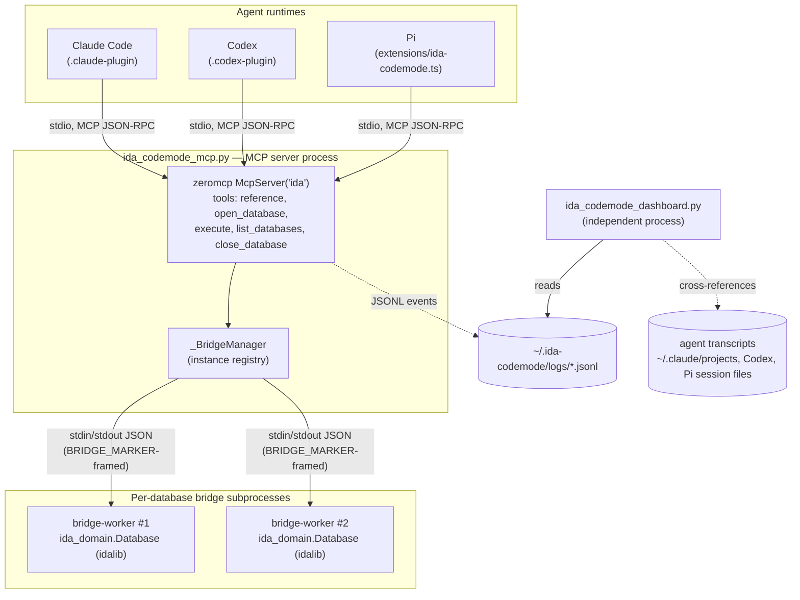
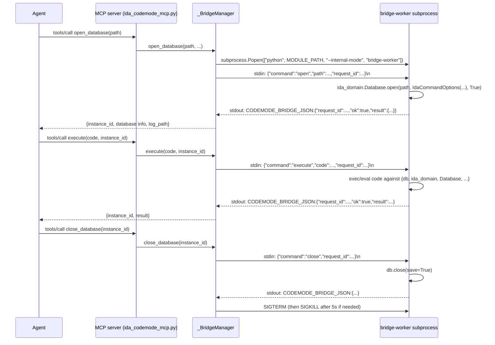
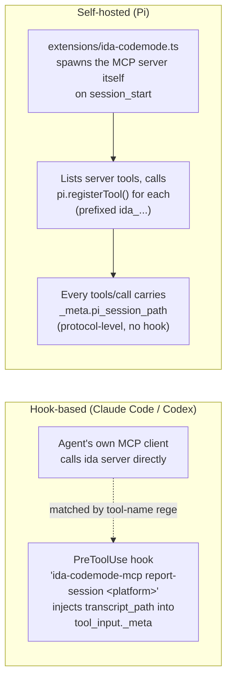
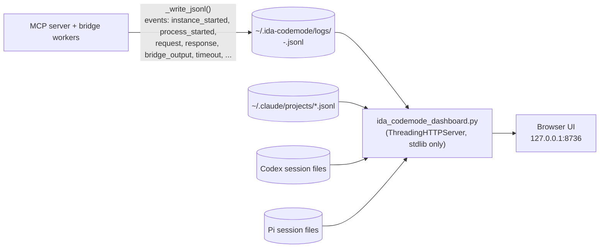

# Architecture

This document describes how `ida-codemode-mcp` is put together: the MCP server core, its
per-database bridge subprocesses, the three agent integrations (Claude Code, Codex, Pi), and
the observability tooling (JSONL logs + dashboard) built on top. It complements `README.md`
(install/usage) and `CONTRIBUTING.md` (dev loop) with the *why* and *how* behind the design.

## 1. Overview

`ida-codemode-mcp` is a [Code Mode](https://blog.cloudflare.com/code-mode/) MCP server for the
[`ida-domain`](https://github.com/HexRaysSA/ida-domain) API: instead of exposing dozens of
narrow reverse-engineering tools, it exposes a handful of tools, the most important of which
(`execute`) lets an LLM agent write and run arbitrary Python against a live, already-open IDA
database. The same Python core is distributed three ways — as a **Claude Code plugin**, a
**Codex plugin**, and a **Pi package** — and is paired with an independent **web dashboard**
for inspecting what happened during a session.

## 2. Repository layout

| Path | Role |
|---|---|
| `ida_codemode_mcp.py` | The MCP server: tool definitions, bridge subprocess manager, bridge-worker entry point, CLI. |
| `ida_codemode_dashboard.py` | Standalone stdlib-only web UI that renders the JSONL logs and cross-referenced agent transcripts. |
| `ida_codemode/` | Authenticated loopback HTTP server and shared runtime used by the GUI plugin and standalone idalib worker. This is not yet connected to the MCP bridge layer. |
| `ida_codemode_plugin.py` | IDA GUI plugin entry point for the local HTTP runtime. |
| `ida-plugin.json` | IDA plugin manifest consumed by `hcli plugin`. |
| `extensions/ida-codemode.ts` | Pi coding-agent extension: spawns the MCP server and re-registers its tools inside Pi's own tool-calling loop. |
| `.claude-plugin/plugin.json` | Claude Code plugin manifest — registers the `ida` MCP server and a `PreToolUse` hook. |
| `.codex-plugin/{plugin.json,mcp.json,hooks.json}` | Equivalent manifest/hook wiring for Codex. |
| `package.json` | Pi package manifest (`pi.extensions`) and the Node dependency for the TS extension. |
| `pyproject.toml` | Python packaging (hatchling); defines the MCP server, dashboard, and standalone worker console scripts. |
| `tests/test_dashboard.py` | Tests for dashboard log-parsing/session-grouping/agent-kind detection. |

## 3. System diagram

The server process and every bridge subprocess it spawns are the only components that touch
IDA. The dashboard never talks to the server directly — it only reads the JSONL files the
server writes.

## 4. MCP tool surface

The server is built on **`zeromcp`** (`>=1.5.0`), a minimal, dependency-free MCP framework that
implements the JSON-RPC protocol (`initialize`, `tools/list`, `tools/call`, stdio and Streamable
HTTP transports) and auto-generates each tool's JSON Schema from Python type hints /
`Annotated[...]` metadata — there are no hand-written schemas in this codebase. `mcp =
McpServer("ida", version="0.2.0")` also has its `tools/call` handler monkey-patched
(`_install_hook_input_meta_adapter`) so a hidden `_meta` field can be smuggled in through tool
arguments (used by the Claude/Codex hooks below) or received natively via the protocol's
`_meta` (used by Pi).

| Tool | Purpose |
|---|---|
| `reference(query)` | Looks up the installed `ida-domain` API. Builds an AST-derived index of every public module/class/function/method plus example scripts (`_build_reference_spec`, cached in-process), scores entries against the query (`_reference_score`), and returns matching docs + one example as plain text. Replaced an earlier `search` tool. |
| `open_database(path, auto_analysis=True, new_database=False, set_current=True, options=None)` | Resolves and validates the path, spawns a new bridge subprocess, sends it an `"open"` command, and returns database info plus an `instance_id`. |
| `execute(code, instance_id=None)` | The Code Mode surface — sends Python source to the target bridge subprocess for execution against the live `db` object. |
| `list_databases()` | Reports every tracked bridge instance (alive/dead, summary, current default, tailed logs), pruning dead ones as a side effect. |
| `close_database(instance_id=None)` | Sends a `"close"` command (which always saves the database) and terminates the subprocess. |

## 5. Process & IPC model

Each `open_database()` call gets its **own OS process** — there is no in-process multiplexing
of IDA databases, because idalib assumes one database per process.

Key pieces:

- **`_BridgeInstance`** — owns one subprocess, a background reader thread (`_read_output`)
  that demultiplexes the child's stdout into either a JSON response (lines prefixed with the
  sentinel `BRIDGE_MARKER = "CODEMODE_BRIDGE_JSON:"`) or a plain log line, and a
  `request()` method that writes a JSON command + `request_id` to the child's stdin and blocks
  (with a timeout) on a response queue keyed by that id.
- **`_BridgeManager`** — the in-memory, lock-guarded registry: `_instances: dict[instance_id ->
  _BridgeInstance]` and `_current_instance_id` (the implicit default target for `execute`/
  `close_database` when no `instance_id` is given). `list_databases()` prunes dead processes
  and reassigns the current instance if it died.
- **`_bridge_instance_main()`** — the worker's own event loop: reads line-delimited JSON
  commands from stdin (`open`/`execute`/`status`/`close`), and replies via `_bridge_emit`
  (which just prints a `BRIDGE_MARKER`-prefixed JSON line to stdout).
- **Trust boundary**: `execute`'s code is resolved by `_find_callable_from_code` (it must
  evaluate to a callable, or define one named `run`/`execute`/`main`) and then invoked with
  `exec`/`eval` — there is **no sandboxing**. Isolation is at the OS-process level only (one
  process per database, so a crash or infinite loop only takes down that database's session);
  anything that can call the MCP server's `execute` tool has full Python + `ida_domain` access.
- **Shutdown**: the server installs `SIGINT`/`SIGTERM` handlers and an `atexit` hook
  (`BRIDGE_MANAGER.shutdown`) that asks every live worker to close (and save) its database
  before terminating it; each worker installs its own signal handlers too, so a directly
  signaled worker still saves before exiting.

## 6. Multi-agent integration model

The same server binary (`uv run ida-codemode-mcp mcp`, stdio transport) is wired into three
different agent runtimes in two structurally different ways:

- **Claude Code / Codex**: the plugin manifest (`.claude-plugin/plugin.json` /
  `.codex-plugin/mcp.json`) registers the `ida` MCP server as a normal subprocess the agent
  connects to directly. A `PreToolUse` hook matching `mcp__(.*[_:])?ida__.*` runs
  `ida-codemode-mcp report-session claude|codex`, which reads the hook payload's
  `transcript_path` and returns an `updatedInput` that injects a hidden `_meta` field
  (`claude_session_path` / `codex_session_path`) into the tool call arguments. The server
  strips this `_meta` back out via `_install_hook_input_meta_adapter` before dispatching.
- **Pi**: `extensions/ida-codemode.ts` spawns the MCP server itself as a child process (same
  `uv run ... ida-codemode-mcp mcp` command) on `session_start`, connects an MCP `Client`,
  lists its tools, and calls `pi.registerTool()` per tool so Pi's own agent loop invokes them
  natively (prefixed `ida_...`, e.g. `ida_execute`). No external hook is needed: the extension
  passes `_meta: { pi_session_path }` on every `tools/call` at the protocol level, which the
  server reads via `mcp.context.meta`. The extension also special-cases rendering of the
  `execute` tool call to syntax-highlight the submitted Python.
- **Correlation key**: all three integrations pass through the `IDA_CODEMODE_ID` environment
  variable, which the server stamps onto every JSONL log record as `codemode_id` — this is the
  one piece of shared state across an otherwise decoupled set of integrations, letting the
  dashboard group unrelated agent sessions that belong to the same benchmark/test run.

## 7. Observability: logs & dashboard

The dashboard is a **separate process with zero coupling** to the MCP server — it can be
started, stopped, or restarted independently, and it only ever reads files:

- Every bridge lifecycle event and request/response payload is appended as JSONL to a
  per-instance log file (`_jsonl_log_path`), keyed by database name + instance id.
- `ida_codemode_dashboard.py` scans that log directory (`_scan_bridge_logs`,
  `_summarize_bridge_log`), groups related logs into `AnalysisSessionGroup`s (by matching
  `codemode_id` or a shared agent session), and — when a log was stamped with a
  `claude_session_path` / `codex_session_path` / `pi_session_path` — reads and interleaves the
  corresponding agent transcript into the timeline at the right timestamps
  (`_interleave_transcript`, `_claude_items`/`_codex_items`/`_pi_items`).
- `_detect_agent_kind()` and `_tool_display_name()`/`_codemode_tool_name()` normalize the
  differing tool-name conventions across agents (`mcp__...ida__execute` for Claude/Codex vs.
  `ida_execute` for Pi) so the UI can render them uniformly.
- It computes per-turn token/cost totals (Claude: per-model pricing with cache-write/read
  multipliers; Pi: cost embedded in its own transcript; Codex: token counts only, no pricing
  table), and supports exporting a session as a single self-contained offline HTML file.
- For safety it binds to `127.0.0.1` by default and only serves transcript files that are
  actually referenced by a bridge log.

## 8. Packaging & distribution

- **Python core**: `pyproject.toml` (hatchling build) packages the MCP server and dashboard
  modules together with the `ida_codemode` HTTP runtime and GUI plugin entry point. It exposes
  `ida-codemode-mcp`, `ida-codemode-dashboard`, and `ida-codemode-worker` console scripts.
  `ida-domain` is pulled straight from a git branch (`[tool.uv.sources]`), not PyPI. Requires
  Python `>=3.11`.
  Since all three plugin manifests invoke `uv run --project <root> ida-codemode-mcp mcp`, local
  edits to the `.py` files take effect immediately — no build step in the dev loop.
- **Node/TS extension**: `package.json` marks the package as a `pi-package` and declares
  `pi.extensions: ["./extensions/ida-codemode.ts"]`; `@earendil-works/pi-coding-agent` is an
  optional peer dependency (only needed when actually running inside Pi). There's no bundler —
  `npm run typecheck` (`tsc --noEmit`) is the only build-adjacent step.
- **Three distribution channels, one core**: Claude Code plugin (`.claude-plugin/`), Codex
  plugin (`.codex-plugin/`), and Pi package (`package.json` + `extensions/`) all wrap the same
  `uv run ida-codemode-mcp mcp` process — they differ only in manifest format and how session
  metadata gets attached (see §6).

## 9. Key design decisions & trade-offs

- **Process-per-database isolation.** idalib supports one database per OS process, so
  `_BridgeManager` spawns a dedicated subprocess per `open_database()` call rather than trying
  to multiplex databases in-process. This also means a crash in one database's `execute()` call
  can't take down the server or other open databases.
- **No sandboxing of `execute()`.** The Code Mode philosophy here is "trust the caller" — the
  trust boundary is whoever can reach the MCP server's `execute` tool, not the Python code
  itself. This keeps the runtime surface simple (plain `exec`/`eval`, full `ida_domain` access)
  at the cost of offering no defense if an untrusted agent gets tool access.
- **Loose coupling via files and env vars, not shared code.** The MCP server, the dashboard,
  and the three agent integrations only agree on two contracts: the JSONL log schema under
  `~/.ida-codemode/logs/` and the `IDA_CODEMODE_ID` env var. None of them import from each
  other. This makes the dashboard optional and lets each agent integration evolve
  independently, at the cost of some duplicated normalization logic (e.g. tool-name mapping)
  on the dashboard side.
- **`zeromcp` as a minimal MCP framework.** Rather than a heavier SDK, the server depends on a
  small, dependency-free implementation that derives JSON Schemas from type hints and supports
  both stdio and Streamable HTTP — keeping the whole server to one file with two dependencies
  (`ida-domain`, `zeromcp`).
- **Session correlation without a shared session concept.** Claude and Codex need an external
  `PreToolUse` hook to smuggle a transcript path into tool arguments (via a hidden `_meta` tool
  argument); Pi instead spawns the server itself and can pass `_meta` at the protocol level
  directly. Both converge on the same server-side field names
  (`claude_session_path`/`codex_session_path`/`pi_session_path`) so the dashboard can treat them
  uniformly.
